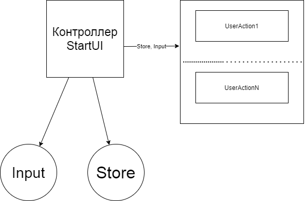
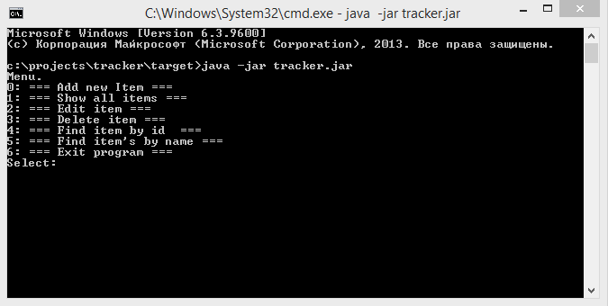
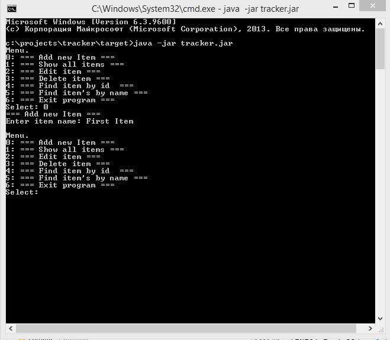
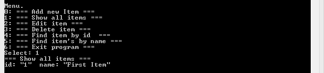
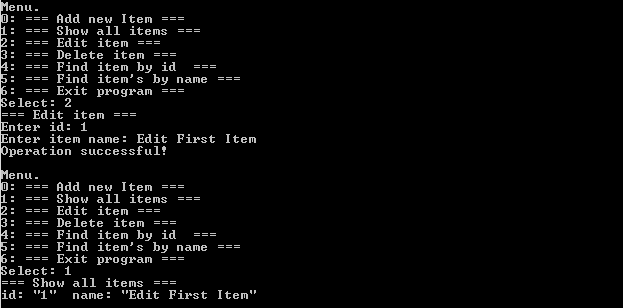
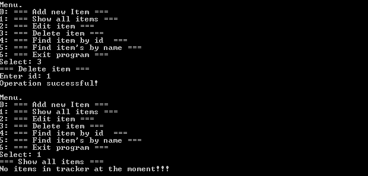

[](https://travis-ci.org/777Egor777/tracker)
[](https://codecov.io/gh/777Egor777/tracker)

# Проект "Трекер заявок"

* [Технологии](#технологии)
* [Описание](#описание)
* [Структура](#структура)
* [Интерфейс](#интерфейс)
* [Инструкция по установке](#инструкция_по_установке)
* [Документация JavaDoc](#javadoc)
* [Тесты](#тесты)
* [Автор](#автор)
* [Критика и предложения](#критика_и_предложения)

## Технологии
* VCS Git
* Java 14
* Apache Maven
* Travis-CI
* JDBC
* PostgreSQL
* Hibernate
* Junit
* Mockito
* Liquibase

## Описание
Простое CRUD-приложение с консольным интерфейсом.
Можно добавлять/удалять/изменять заявки, а так же выводить все текущие.

## Структура


Проект делится на слои:
1. Ввод (интерфейс [Input](src/main/java/ru/job4j/tracker/input/Input.java)). 
Основная реализация - [ConsoleInput](src/main/java/ru/job4j/tracker/input/ConsoleInput.java), обеспечивающая пользовательский
ввод с консоли. Так же реализована обёртка [ValidateInput](src/main/java/ru/job4j/tracker/input/ValidateInput.java) для валидации ввода из
любого объекта, реализующего Input. Можно создать класс, реализующий интерфейс
Input для пользовательского ввода из любого другого источника(файл, веб и тд),
и установить его экземпляр как объект для ввода без изменения остального кода
2. Хранилище (интерфейс [Store](src/main/java/ru/job4j/tracker/store/Store.java)).
Отвечает за хранение заявок. В проекте есть следующие реализации:
    2.1 [MemTracker](src/main/java/ru/job4j/tracker/store/MemTracker.java)
        Хранилище, использующее память, выделяемую с помощью JVM.
        То есть, обычный Java-объект.
        Соответственно, заявки не сохраняются после завершения работы программы.
    2.2 [SqlTracker](src/main/java/ru/job4j/tracker/store/SqlTracker.java)
        Хранилище, использующее PostgreSql базу данных. Взаимодействие с 
        базой происходит при помощи JDBC - протокола.
    2.3 [HibernateTracker](src/main/java/ru/job4j/tracker/store/HibernateTracker.java)
        Хранилище, использующее PostgreSql базу данных. Взаимодействие с 
        базой происходит при помощи Hibernate.
3. Контроллер [StartUI](src/main/java/ru/job4j/tracker/StartUI.java).
    * Создаёт все необходимые для рабоыт приложения объекты
    * Обеспечивает интерактивное взаимодействие с пользователем.
    * Создаёт все необходимые объекты [UserAction](src/main/java/ru/job4j/tracker/action), выполняющие
    выбранное пользователем действие
4. Интерфейс "пользовательское действие" [UserAction](src/main/java/ru/job4j/tracker/action/UserAction.java). 
   Принимает объекты ввода и хранилища, и реализует определённое действие, которое выбрал пользователь.
   Например, добавить запись в Трекер.     
## Интерфейс
Как запустить приложение см. в [этом разделе](#инструкция_по_установке)
1. При старте работы приложения пользователю в консоль выводится меню, из которого можно выбрать действие.

Типы действий: 
* Добавить новую запись
* Вывести все записи, находящиеся в хранилище в данный момент
* Редактировать существующую запись
* Удалить запись
* Найти и вывести запись с определённым `id`
* Найти и вывести записи с определённым именем
* Завершить работу приложения



2. Добавим новую запись в Трекер.



3. Выведем все записи



Как видим, запись была успешно добавлена в Трекер

4. Изменим её и снова выведем все записи



5. Удалим запись и выведем все записи



## Инструкция_по_установке
1. [Скачать JAR](https://drive.google.com/file/d/123-UnZFd_hQUaakKhfdvQg9N2UnTK3iW/view?usp=sharing)
2. Запустить командную строку
3. Перейти в папку, где находится tracker.jar 
4. Запустить jar-файл. Важно! Необходимо иметь на машине установленный JRE.

```
java -jar tracker.jar
```


## JavaDoc
TODO оплатить хостинг, домен. Загрузить туда документацию по всем проектам
## Тесты
На код написаны тесты.
Процент покрытия подсчитывается плагином Jacoco, его можно посмотреть в шапке данного README файла.
Модульные тесты написаны с использованием технологий Junit, Hamcrest, Mockito.
На SQLTracker написаны интеграционные тесты с помощью liquibase.

## Автор

Гераськин Егор Владимирович

Java-разработчик

yegeraskin13@gmail.com

+79271506651

## Критика_и_предложения
Все замечания и пожелания по этому проекту просьба направлять мне 
на электронный адрес: yegeraskin13@gmail.com
